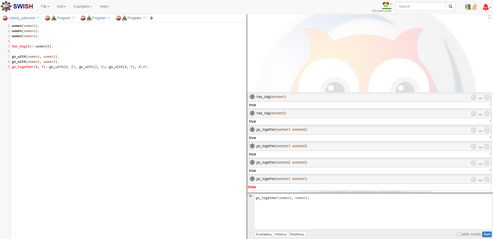

# Laboratorium 6
## Tomasz Smolarek 127473

Obraz


Rezultat



Kod programu:
```prolog
women(women1).
women(women2).
women(women3).

has_bag(X):-women(X).

go_with(women1, women2).
go_with(women2, women3).
go_together(X, Y):-go_with(X, Z), go_with(Z, Y); go_with(X, Y), X\=Y.
```