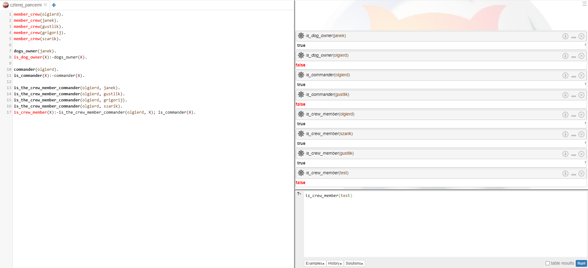

# Laboratorium 6
## Tomasz Smolarek 127473

Obraz


Rezultat



Kod programu:
```prolog
member_crew(olgierd).
member_crew(janek).
member_crew(gustlik).
member_crew(grigorij).
member_crew(szarik).

dogs_owner(janek).
is_dog_owner(X):-dogs_owner(X).

commander(olgierd).
is_commander(X):-commander(X).

is_the_crew_member_commander(olgierd, janek).
is_the_crew_member_commander(olgierd, gustlik).
is_the_crew_member_commander(olgierd, grigorij).
is_the_crew_member_commander(olgierd, szarik).
is_crew_member(X):-is_the_crew_member_commander(olgierd, X); is_commander(X).
```