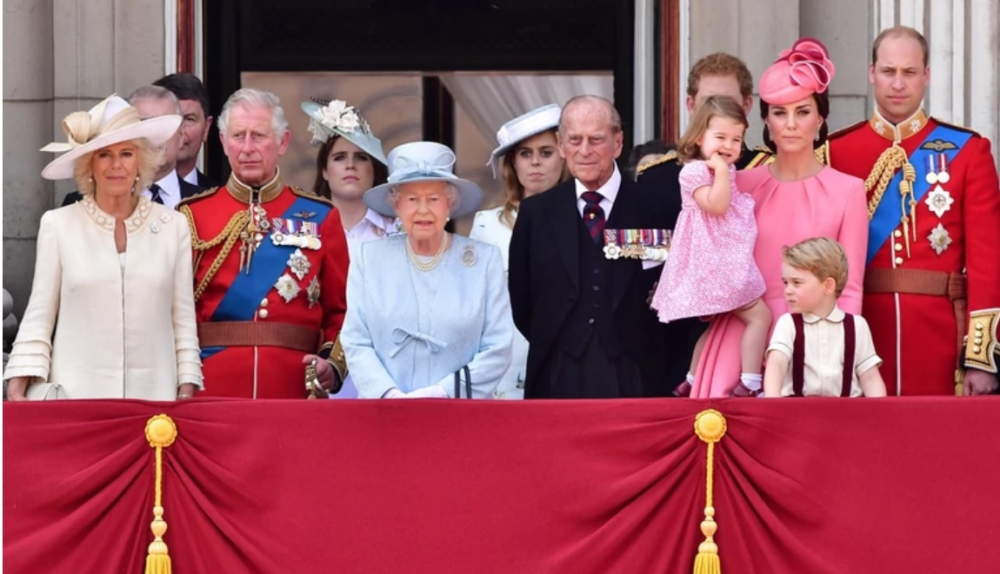
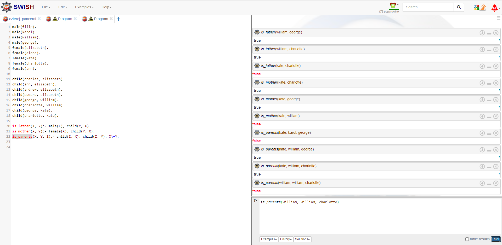

# Laboratorium 6
## Tomasz Smolarek 127473

Obraz


Rezultat



Kod programu:
```prolog
male(filip).
male(karol).
male(william).
male(george).
female(elizabeth).
female(diana).
female(kate).
female(charlotte).
female(ann).

child(charles, elizabeth).
child(ann, elizabeth).
child(andrew, elizabeth).
child(edward, elizabeth).
child(george, william).
child(charlotte, william).
child(george, kate).
child(charlotte, kate).

is_father(X, Y):- male(X), child(Y, X).
is_mother(X, Y):- female(X), child(Y, X).
is_parents(X, Y, Z):- child(Z, X), child(Z, Y), X\=Y.
```